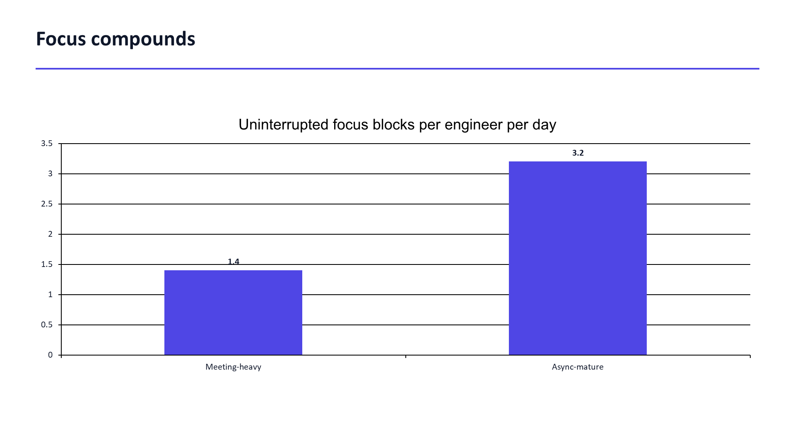
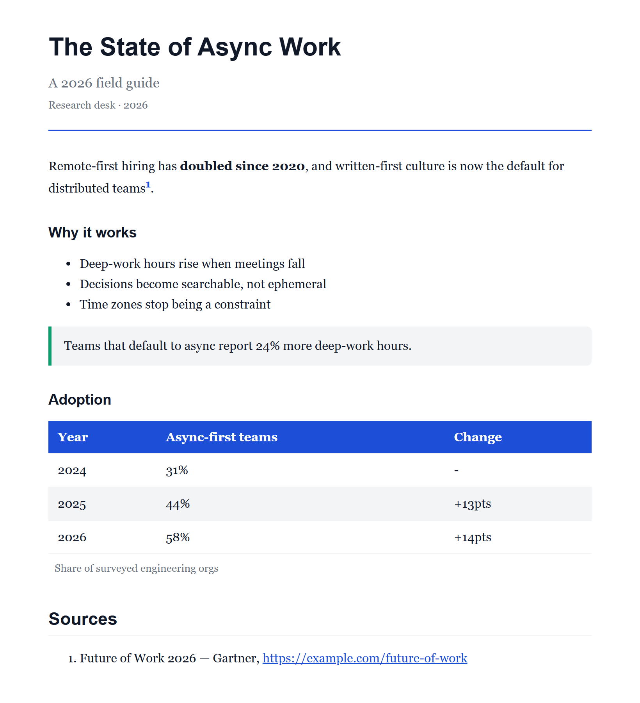
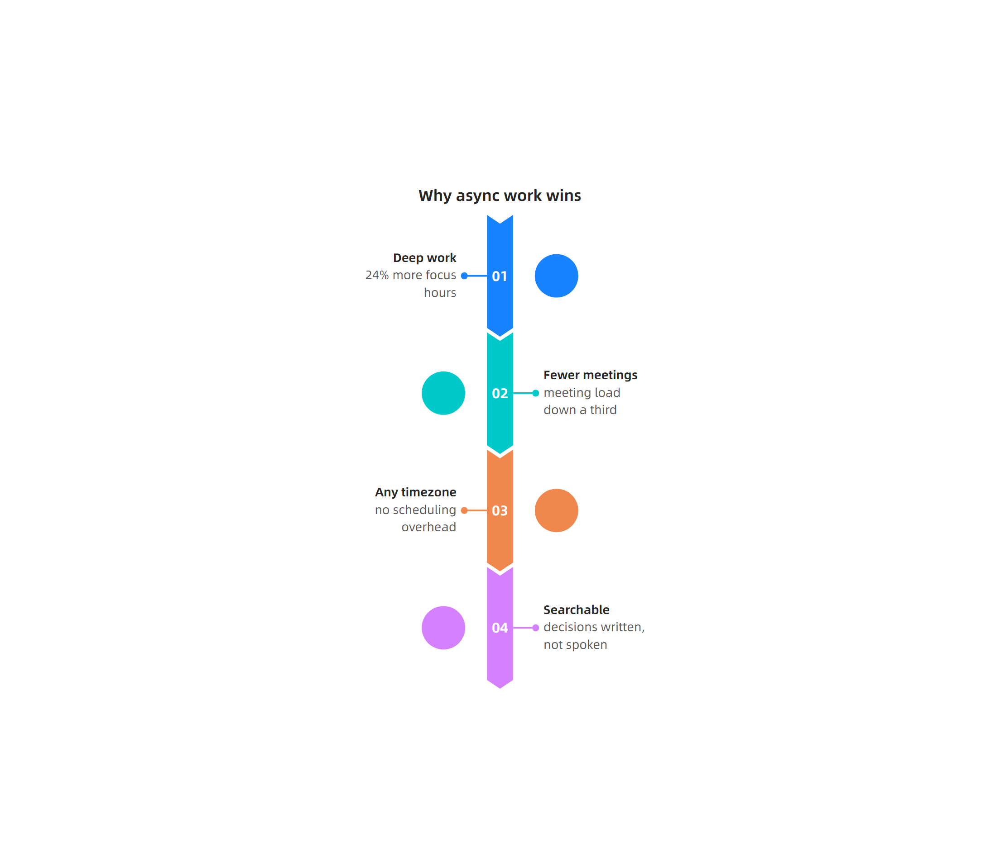
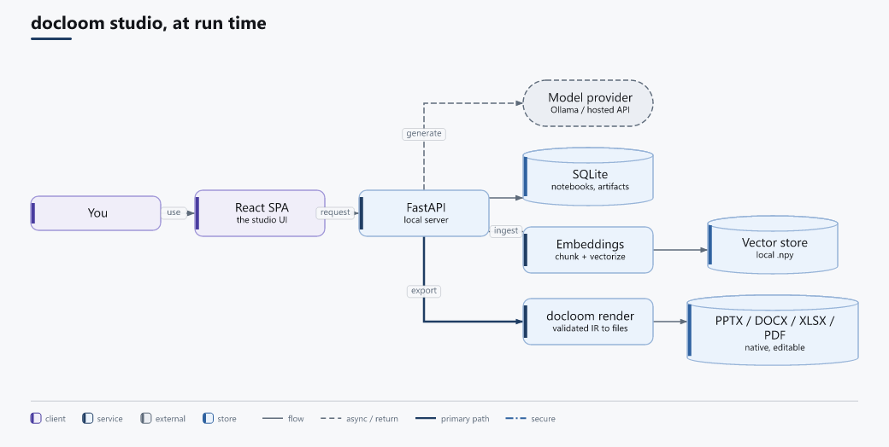
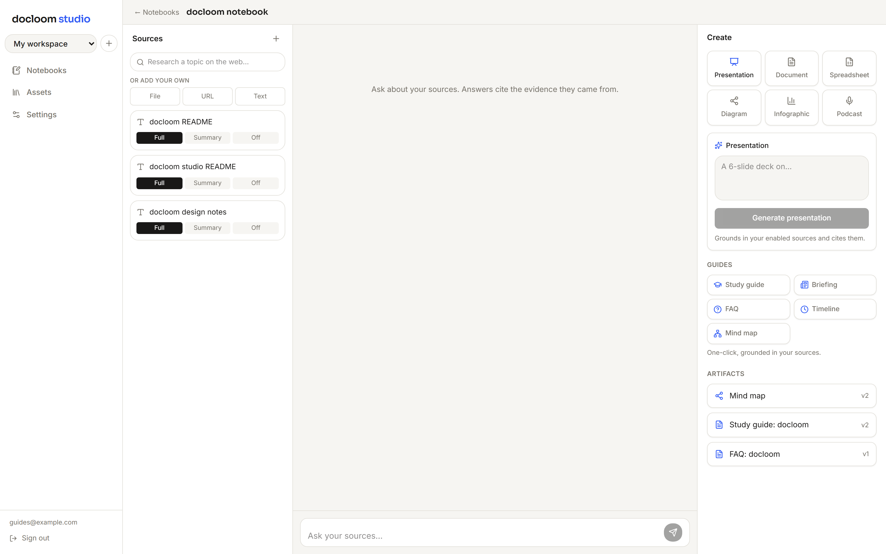

<!-- krt -->
# docloom

docloom turns a language model's structured output into documents. Your model emits a validated document, and deterministic renderers produce PPTX, DOCX, XLSX, PDF, HTML, and Markdown, with a linter that returns machine-readable findings the model can correct against.


This repository contains two projects: [`docloom`](docloom/), the render engine (a pip-installable Python library), and [`docloom-studio`](docloom-studio/), a local-first app built on it.

## Install

docloom is not published to PyPI yet, so install the engine from this repository:

```bash
git clone https://github.com/kirti34n/docloom.git
cd docloom
pip install -e "./docloom[pdf]"      # editable install of the engine
```

Or in one line, without cloning:

```bash
pip install "docloom[pdf] @ git+https://github.com/kirti34n/docloom.git#subdirectory=docloom"
```

## Getting started

Build a document and render it. The same document renders to any format.

```python
from docloom import Document, render

doc = Document(title="Q3 review", slides=[
    {"layout": "title", "title": "Q3 review"},
    {"layout": "content", "title": "Highlights", "blocks": [
        {"type": "stats", "items": [{"label": "Revenue", "value": "$4.2M", "delta": "+24%"}]},
        {"type": "bullets", "items": [{"text": "Enterprise pipeline doubled"}]},
    ]},
])

render(doc, "pptx", "q3.pptx")
render(doc, "pdf", "q3.pdf")
```

Runnable samples for every feature, with their rendered output, are in [`examples/`](examples/).

## Rendering to formats

One document carries slides (a deck), blocks (a report), and sheets (a workbook). Each renderer takes what it needs.

| Format | Engine | Output |
| --- | --- | --- |
| PPTX | python-pptx | Native editable charts, tables, speaker notes |
| DOCX | python-docx | Styled headings, callouts, numbered citations |
| XLSX | xlsxwriter | Real formulas and number formats |
| PDF | Typst | Typeset in-process, embedded fonts |
| HTML | built-in | One self-contained file |
| Markdown | built-in | Portable text |

## Generating from a model

The document is a Pydantic model, so it doubles as a structured-output target. `llm_schema()` returns the JSON Schema for strict structured-output modes, and `parse_llm_output()` accepts output that is fenced or wrapped.

```python
from docloom import llm_schema, parse_llm_output, lint, render

# call your model with llm_schema() as the response format, then:
doc = parse_llm_output(model_output)   # tolerant of fenced or wrapped JSON
findings = lint(doc)                    # [] or machine-readable findings
render(doc, "pptx", "deck.pptx")
```

The schema is non-recursive and uses plain tagged unions, so it validates under both OpenAI strict mode and Anthropic structured outputs.

## What it produces

| Presentation with a native chart | Grounded, cited document |
| :---: | :---: |
|  |  |

| Infographic | Diagram |
| :---: | :---: |
|  |  |

**See the real output — docloom explaining itself.** [`examples/dogfood/`](examples/dogfood/)
holds a full set of documents (a deck, a 95-block whitepaper in four formats, an infographic, a
spreadsheet, and two architecture diagrams) that docloom generated from its own
[`PROJECT.md`](PROJECT.md): a model authored the validated IR, and these deterministic renderers
produced the files in [`examples/dogfood/output/`](examples/dogfood/output/). The complex
architecture diagram is laid out by the optional Graphviz-`dot` backend (`pip install "docloom[dotlayout]"`),
which keeps branching graphs compact; the `.drawio` exports open editable in draw.io.

## docloom studio

docloom studio is a free, local-first app built on the engine. You add sources to a notebook, ask questions that are answered with citations, and generate six kinds of artifact: editable decks, documents, spreadsheets, diagrams, infographics, and two-host podcast audio overviews. The first five export through docloom to real PPTX/DOCX/XLSX/PDF/HTML/MD; podcast audio is synthesized straight to `.wav` and never touches docloom's renderers.



- Notebooks with your uploaded sources or agent web research
- Retrieval-grounded chat that cites its sources
- One-click guides: study guide, briefing, FAQ, timeline, and mind map
- A brand kit applied to every export
- Runs on your machine; a local model works offline

> [!NOTE]
> **Diagrams share one pipeline.** docloom studio generates the engine's coordinate-free `Diagram`
> IR (nodes/edges/groups, no coordinates), lays it out with the engine's own solver, and edits it in
> a self-hosted, offline [draw.io](https://www.drawio.com) editor seeded from that IR (see
> [`docloom/README.md`](docloom/README.md#architecture-diagrams) for the IR and its SVG/PPTX/`.drawio`
> emitters). Generated decks and reports embed the same IR inline, so a diagram is authored, edited,
> and rendered through one system. The old client-side [D2](https://d2lang.com) editor survives only
> to open diagrams authored before the switch.

One command brings the studio up — installs dependencies, builds the frontend, launches the
server (API + SPA on one port), and opens a browser. Run it from the repository root:

```powershell
.\studio.ps1      # Windows (PowerShell)
./studio.sh       # macOS / Linux / Git Bash
```

Needs [`uv`](https://docs.astral.sh/uv), [Node 22+](https://nodejs.org), and npm. First run takes
a few minutes; later runs launch immediately. Flags: `-Rebuild`/`--rebuild`, `-Port`/`--port`,
`-NoBrowser`/`--no-browser`. The launcher also re-checks the `resvg` rasterizer on every start so
studio diagrams/charts/infographics can never silently export blank. See
[`docloom-studio/README.md`](docloom-studio/README.md#quickstart) for the equivalent manual steps.

> [!NOTE]
> `../docloom[pdf,diagrams]` needs both extras, but `[diagrams]` is not what stands between you and
> a blank export: docloom's own `Chart`/`Diagram` blocks render in every format with `[diagrams]`
> absent — HTML, Markdown, and PDF embed them as true vector SVG (no rasterizer involved either
> way), and PPTX/DOCX fall back to a data table (charts) or a labeled placeholder (diagrams)
> instead of a picture. The one place `[diagrams]` actually prevents a blank is docloom studio's
> browser-rendered infographic editor: if the browser never saved a picture for an infographic,
> HTML/Markdown/PDF/DOCX export it as nothing at all (PPTX alone shows a placeholder) unless the
> server can rasterize it itself, which needs `[diagrams]`. `.[dev]`
> installs pytest only; running the ingest test suite also needs the separate `.[ingest]` extra
> (EPUB and YouTube-transcript parsing), and podcast audio generation needs the separate
> `.[podcast]` extra (`kokoro` + `soundfile`) on `docloom-studio`.

> [!NOTE]
> Set the generation model in Settings. A local Ollama model (qwen3.5 works well) runs fully offline; a hosted API key is optional.

## Repository

| Path | What it is |
| --- | --- |
| [`docloom/`](docloom/) | The render engine (pip installable, MIT) |
| [`docloom-studio/`](docloom-studio/) | The local-first studio app |
| [`examples/`](examples/) | Runnable samples for each feature, with rendered output |

## License

MIT.

<sub>Maintained by <b>krt</b>.</sub>
