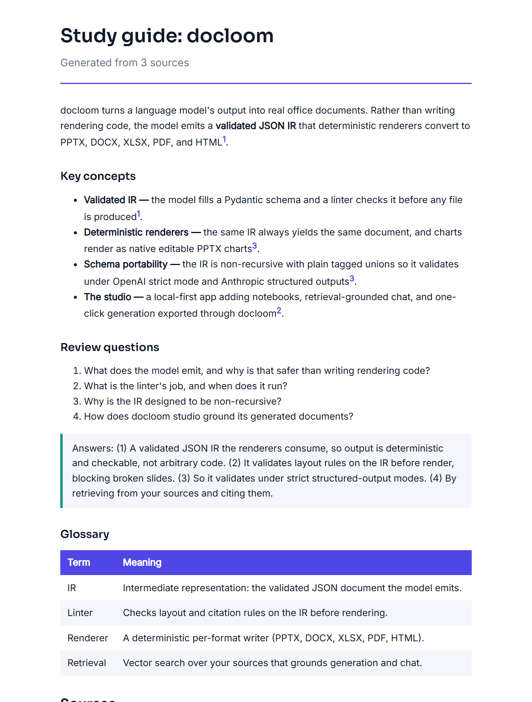

<!-- krt -->
<div align="center">

# docloom

**The document output layer for AI apps.**
Your LLM emits a validated JSON schema; docloom deterministically renders
**PPTX, DOCX, XLSX, PDF, and HTML**, with a linter that catches broken slides
before anyone sees them.


</div>


---

## Why

Teams wire LLMs to make slides and reports two ways, and both break:

- **LLMs writing python-pptx code:** non-deterministic, unvalidated, fails silently.
- **Markdown-to-slides:** lossy, no native charts, no brand control.

docloom takes a third path: the model fills a **validated JSON IR**, a **linter**
checks it, and **deterministic renderers** produce real files. The model owns the
content; docloom owns the pixels.

## Quickstart

```bash
pip install "docloom[pdf]"
```

```python
from docloom import Document, render

doc = Document(title="Q3 review", slides=[
    {"layout": "title", "title": "Q3 review"},
    {"layout": "content", "title": "Highlights", "blocks": [
        {"type": "stats", "items": [{"label": "Revenue", "value": "$4.2M", "delta": "+24%"}]},
        {"type": "bullets", "items": [{"text": "Enterprise pipeline doubled"}]},
    ]},
])

render(doc, "pptx", "q3.pptx")   # also: docx, xlsx, pdf, html
```

Runnable samples for every feature live in [`examples/`](examples/).

<details>
<summary><b>What each format gives you</b></summary>

| Format | Engine | Highlights |
| --- | --- | --- |
| PPTX | python-pptx | Native editable charts, tables, speaker notes, per-slide accents |
| DOCX | python-docx | Styled headings, callouts, numbered citations |
| XLSX | xlsxwriter | Real formulas and number formats |
| PDF | typst | High-quality typesetting, embedded fonts |
| HTML | built-in | One self-contained file, fonts and images inlined |

</details>

<details>
<summary><b>Design principles</b></summary>

- **Schema, not code:** the LLM fills a Pydantic schema; it never writes rendering code.
- **Validate before render:** the linter rejects broken layouts before any file is produced.
- **Deterministic renderers:** the same IR always produces the same document.
- **Semantic theming:** renderers map theme tokens to native mechanisms, so one theme keeps every format on-brand.
- **Local first:** everything runs on your machine by default; API keys are optional.

</details>

## What it produces

| Presentations (native charts) | Grounded, cited documents |
| :---: | :---: |
|  |  |

## docloom studio

A free, local-first app built on the engine (NotebookLM plus Gamma, self-hosted):

- **Notebooks** with your uploaded sources or agent web research
- **Retrieval-grounded chat** that answers with citations
- One-click generation of editable **decks, documents, sheets, diagrams, and infographics**
- **Guides:** Study guide, Briefing, FAQ, Timeline, and Mind map, grounded in your sources
- Premium **D2** diagrams (no Mermaid), and a brand kit applied to every export

| Notebook workspace and one-click guides | D2 diagrams |
| :---: | :---: |
|  |  |

```bash
# from docloom-studio/
pip install -e "../docloom[pdf]" && pip install -e ".[dev]"
cd web && npm install && npm run build
python -m docloom_studio.main        # opens http://127.0.0.1:8899
```

Point the generation model at a local Ollama model (qwen3.5 recommended) or a
hosted API in Settings. Everything works offline with a local model.

## Repository

- [`docloom/`](docloom/) - the render engine (pip installable, MIT)
- [`docloom-studio/`](docloom-studio/) - the local-first studio app
- [`examples/`](examples/) - runnable samples for each feature

## License

MIT.

<div align="center">
<sub>Maintained by <b>krt</b>.</sub>
</div>
