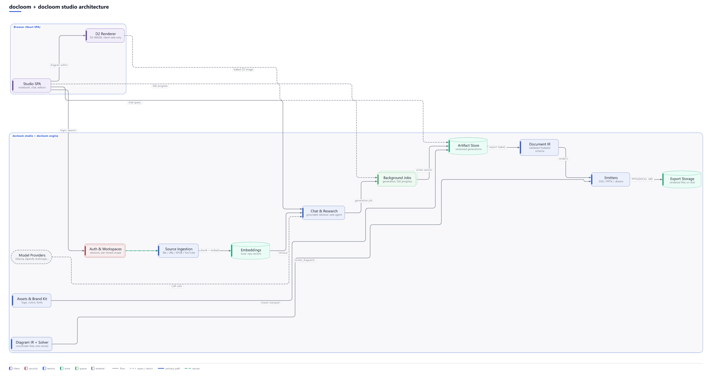

# docloom studio


A free, local-first AI document studio: think NotebookLM crossed with Gamma. Add sources to a
notebook, chat with answers that cite the evidence, and generate editable decks, documents,
spreadsheets, diagrams, infographics, and podcasts, exported through [docloom](../docloom) to real
PPTX/DOCX/XLSX/PDF. No account with a third party, no cloud dependency: a local model runs it
fully offline.


## How it fits together

docloom studio owns sources, retrieval, chat, and generation; the docloom engine turns whatever
gets generated into a validated document and renders it deterministically.



## Features

- **Notebooks** with your own sources (file, URL, or pasted text) or agent web research: the agent
  plans searches, fetches pages, and keeps them as cited sources, no API key required
- **Grounded chat**: embeddings + ranking retrieve the relevant chunks, and every answer cites
  where it came from
- **One-click guides**: study guide, briefing, FAQ, timeline, and mind map, each a grounded
  generation from your sources
- **Six artifact kinds**: presentations, documents, spreadsheets, D2 diagrams, infographics, and
  two-host podcast audio overviews
- **A brand kit** (logo, accent color, fonts) applied to every generation and every export
- **Local-first**: SQLite by default and nothing to configure; Postgres is a `DOCLOOM_DB_URL` away
  for a multi-node deployment

## Quickstart

```bash
git clone https://github.com/kirti34n/docloom.git
cd docloom

python -m venv .venv
.venv\Scripts\activate            # Windows
# source .venv/bin/activate       # macOS / Linux

pip install -e "./docloom[pdf]"           # the render engine
pip install -e "./docloom-studio[dev]"    # the studio backend

cd docloom-studio/web && npm install && npm run build && cd ../..

python -m docloom_studio.main             # http://127.0.0.1:8899
```

The first run creates its data directory (SQLite DB, uploaded sources, exports) under
`%LOCALAPPDATA%\docloom-studio` (Windows) or `~/docloom-studio` (macOS/Linux); set
`DOCLOOM_STUDIO_HOME` to point it somewhere else. Register an account on first visit; everything
you create lives in a workspace scoped to your login.

## Configuring a model

Open **Settings** in the running app and pick a provider. Generation and embeddings are
configured separately, and the model list is fetched live from whichever base URL you set.

| Provider | Notes |
| --- | --- |
| **Ollama** (default) | Fully offline. Install [Ollama](https://ollama.com), then `ollama pull qwen3.5:9b` and `ollama pull nomic-embed-text`. |
| **llama.cpp server** | The most reliable local option: real JSON-schema enforcement instead of a prompt-injected schema. |
| **LM Studio** | Enable its local server and point the base URL at it. |
| **OpenAI** / **Anthropic** | Paste an API key; nothing local to install. |

## Docker

The image needs both `docloom/` and `docloom-studio/` in its build context, since the studio
depends on the engine and the engine isn't published to PyPI. Build from the **repository root**
(the parent of both directories), not from inside `docloom-studio/`:

```bash
docker build -t docloom-studio -f docloom-studio/Dockerfile .
docker run -p 8899:8899 -v docloom-data:/data docloom-studio
```

Data (the SQLite DB, uploaded assets, exports) lives under `/data` in the container; the volume
mount above persists it across restarts.

## Tests

```bash
pytest -q                                  # from docloom-studio/, backend
cd web && npm run lint && npx vitest run   # frontend
```

## Repository

See the [root README](../README.md) for the engine (`docloom/`) this app is built on, and
[`examples/`](../examples/) for runnable samples of what gets rendered.

## License

MIT.
