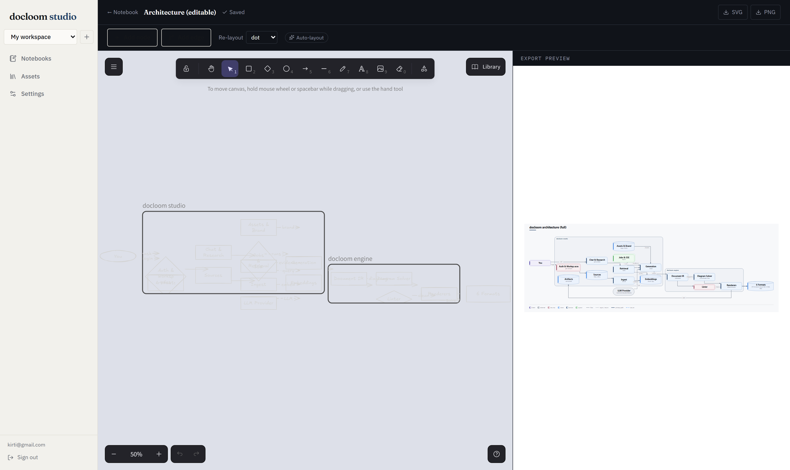

# docloom studio


A free, local-first AI document studio: think NotebookLM crossed with Gamma. Add sources to a
notebook, chat with answers that cite the evidence, and generate editable decks, documents,
spreadsheets, diagrams, and infographics, exported through [docloom](../docloom) to real
PPTX/DOCX/XLSX/PDF/HTML/MD, plus two-host podcast audio overviews synthesized straight to `.wav`
(podcasts never go through docloom's renderers). No account with a third party, no cloud
dependency: a local model runs it fully offline.


## How it fits together

docloom studio owns sources, retrieval, chat, and generation; the docloom engine turns whatever
gets generated into a validated document and renders it deterministically.


### Visual diagram editor (in-app)

Diagrams are the engine's own coordinate-free `Diagram` IR end to end: generation emits IR (not
D2), and you edit it on a **visual canvas inside the studio** — add, connect, retype, and group
nodes on an [Excalidraw](https://excalidraw.com) canvas, with a live **export preview** that is the
exact same engine render your deck ships (preview == export, by construction). The layout is solved
for you (`native` or the compact Graphviz **`dot`** backend for dense graphs); the same
`Diagram` IR renders to SVG, native PPTX shapes, and editable `.drawio`.



Older diagrams saved as [D2](https://d2lang.com) source still open in the legacy text editor;
free node positioning (dragging a node to a fixed spot) is a planned opt-in on top of the current
auto-layout.

## Features

- **Notebooks** with your own sources (file, URL, or pasted text) or agent web research: the agent
  plans searches, fetches pages, and keeps them as cited sources, no API key required
- **Grounded chat**: embeddings + ranking retrieve the relevant chunks, and every answer cites
  where it came from
- **One-click guides**: study guide, briefing, FAQ, timeline, and mind map, each a grounded
  generation from your sources
- **Six artifact kinds**: presentations, documents, spreadsheets, architecture diagrams (edited on
  an in-app visual canvas, see "How it fits together" above), infographics, and two-host podcast
  audio overviews
- **A brand kit** (logo, accent color, fonts) applied to every generation and every export
- **Local-first**: SQLite by default and nothing to configure; Postgres is a `DOCLOOM_DB_URL` away
  for a multi-node deployment

## Quickstart

One command brings the whole app up — it installs dependencies, builds the frontend, and starts
the server (API + SPA) on one port, then opens a browser. Run it from the **repository root**:

```powershell
# Windows (PowerShell)
.\studio.ps1
```

```bash
# macOS / Linux / Git Bash
./studio.sh
```

It needs [`uv`](https://docs.astral.sh/uv), [Node 22+](https://nodejs.org), and npm on `PATH`.
The first run takes a few minutes (venv + npm install + web build); every run after that skips
straight to launch. Useful flags: `-Rebuild` / `--rebuild` (force a fresh web build),
`-Port 9000` / `--port 9000`, `-NoBrowser` / `--no-browser`, `-Setup` / `--setup` (force a
dependency reinstall). On the first visit, register an account; everything you create lives in a
workspace scoped to your login.

The launcher also **verifies the SVG rasterizer (resvg) on every start**. Without it, generated
diagrams, charts, and infographics export as silent blanks — a capability gap no test catches —
so the script installs it if a partial setup left it out.

<details>
<summary>What the one command does (equivalent manual steps)</summary>

```bash
git clone https://github.com/kirti34n/docloom.git
cd docloom

# from docloom-studio/, create the studio venv and install both packages editable:
uv venv
uv pip install -e "../docloom[pdf,diagrams]"  # the render engine. [diagrams] is what pulls the
                                               # resvg rasterizer. docloom's own Chart/Diagram
                                               # blocks still render everywhere without it (SVG in
                                               # HTML/MD/PDF, a data table or placeholder in
                                               # PPTX/DOCX); what [diagrams] prevents is a blank
                                               # export of THIS studio's own browser-rendered
                                               # diagrams/infographics when no picture was saved
                                               # client-side. Installing the engine WITHOUT the
                                               # extra (`-e ../docloom` alone) satisfies the
                                               # studio's `docloom[pdf,diagrams]` dependency by
                                               # name and silently omits resvg -- which is why the
                                               # launcher re-checks it on every start.
uv pip install -e "."                          # the studio backend. Extras: [dev] (pytest),
                                               # [ingest] (EPUB/YouTube sources), [podcast]
                                               # (kokoro + soundfile audio), [postgres].

cd web && npm install && npm run build && cd ..

python -m docloom_studio.main                  # http://127.0.0.1:8899
```
</details>

The first run creates its data directory (SQLite DB, uploaded sources, exports) under
`%LOCALAPPDATA%\docloom-studio` (Windows) or `~/docloom-studio` (macOS/Linux); set
`DOCLOOM_STUDIO_HOME` to point it somewhere else.

## Configuring a model

Open **Settings** in the running app and pick a provider. Generation and embeddings are
configured separately, and the model list is fetched live from whichever base URL you set.

| Provider | Notes |
| --- | --- |
| **Ollama** (default) | Fully offline. Install [Ollama](https://ollama.com), then `ollama pull qwen3.5:9b` and `ollama pull nomic-embed-text`. |
| **llama.cpp server** | The most reliable local option: real JSON-schema enforcement instead of a prompt-injected schema. |
| **LM Studio** | Enable its local server and point the base URL at it. |
| **OpenAI** / **Anthropic** | Paste an API key; nothing local to install. |

## Docker

The image needs both `docloom/` and `docloom-studio/` in its build context, since the studio
depends on the engine and the engine isn't published to PyPI. Build from the **repository root**
(the parent of both directories), not from inside `docloom-studio/`:

```bash
docker build -t docloom-studio -f docloom-studio/Dockerfile .
docker run -p 8899:8899 -v docloom-data:/data docloom-studio
```

Data (the SQLite DB, uploaded assets, exports) lives under `/data` in the container; the volume
mount above persists it across restarts.

## Tests

```bash
pytest -q                                  # from docloom-studio/, backend
cd web && npm run lint && npx vitest run   # frontend
```

## Repository

See the [root README](../README.md) for the engine (`docloom/`) this app is built on, and
[`examples/`](../examples/) for runnable samples of what gets rendered.

## License

MIT.
